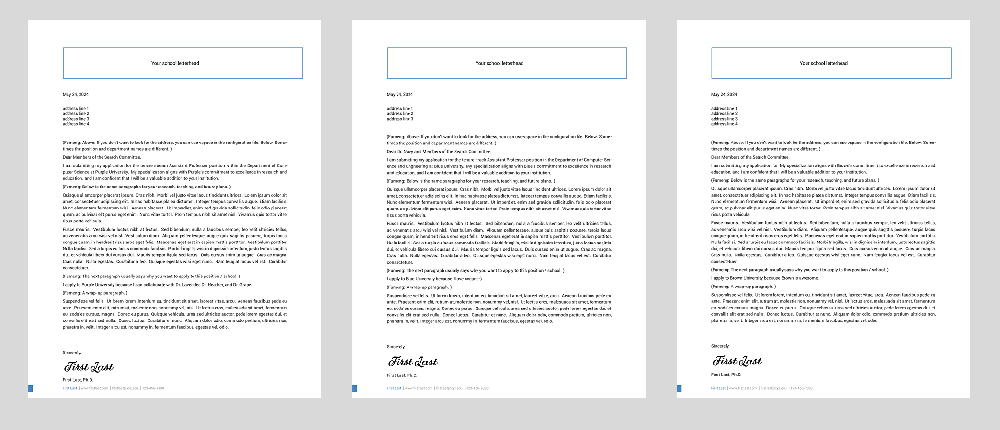

# template-cover-letter-2024

This is the LaTeX + Node.js template  I created for the cover letters of my faculty job applications in the 2023-24 cycle. 
This framework is the best when you have dozens of similar letters, but each needs some customization. If you are not thinking about customization, you don't need this framework.

Basically, the Node.js code automatically generates PDF files for different positions based on the configuration files. You can then find them in `letters/pdfs`.

# Setup

To use this framework, you MUST have a local LaTeX/XeLaTeX setup (XeLaTeX for different fonts). Here (https://www.latex-project.org/get/) gives you instructions about different OS. I also recommend a local LaTeX compiler such that you can debug. For macOS, TexMaker is free, and I use a paid one Texifier. 

## Basics
- You should replace the content in `fig`.

- `template.tex` is the outline of the whole tex file.  You probably don't need to make major changes this file. It takes two important input files: 
  
    - `format.tex` This file defines the format. At the very least, you should change the `hookcolor` (around line 19) to your home school color, and change the name and contact (around line 73) to yours.
  
    - `sameforall.tex` As explained by its name, this file defines the share content of the main body (e.g., your degree, research, and teaching) with **customization** placeholders. 
    -  **Customization** placeholders must start with a seperate line, and with a format like `title-line%#title-line`. I talk about how this works below. Roughly, the Node.js (`letters/generate-letters.js`) script will replace these placeholders with the content configuration files to generate a tex file for each school and compile it. 
 
 -  The `school-customization` folder contains configuration files. If you need to add a school, copy and add a file like 'new- school.tex'. 
    
    - Each school has its configuration file. Each configureation file gives information to fill in the placeholder. It must follow the format such that the Node.js file knows the mapping.
        > %---  
        title-line%#title-line    
        ... % the actual content. 
    
    - If you don't need a customization, don't leave it blank or delete it. Put something like '\vspace' or '{}' there; otherwise, the Node.js script doesn't know what to do (I was a little lazy when writing the Node.js script).
  

- `letters/generate-letters.js` is where the magic happens.
  
   - When you add a new school, you also add the file name (e.g., new-school) to the holder (around line 5). 
   - Run this js file using `node generate-letters.js` under the same folder.
   - This file reads all files abovementioned, replaces the placeholders with the specification in the school configuraiton, outputs the tex file to `letters`, and compile and move the final PDF file to `letters/pdfs`. 
   - You should see the command line outputs something like 
        > ...  
        stdout:   
        stderr:   
        total : 3
    - Open `letters/pdfs`, you should see each school has its own file with appropriate customization.  
    
# Debug

If the command line does not terminate, something went wrong. It's quite difficult to debug. 

First, you should check if the Node.js file generats tex files in `letters`. 

You then use a local editor (e.g., TexMaker or Texifier) to open and compile a tex file (e.g., `NEW-SCHOOL-letter.tex`) to diagnose the issues. 

You can also try to upload the tex file to overloaf if you don't want to have a local editor. But having a local editor was the only way to do this before overleaf/sharedlatex dominates.....

# Notes

You can find my research statement's template here (https://github.com/Fumeng-Yang/template-research-statement-2024). I use the same font and color. I also advise that these fonts should be the same or similar to your CV font. 

You can change the font in `format.tex` (around line 59, remember to add `ttf` files)!

# Blah

Presumably, a python version of this will be nice :-). The `generate-letters` file should not be too hard to write. This framework took me a couple of hours, although debugging was a bit plainful.